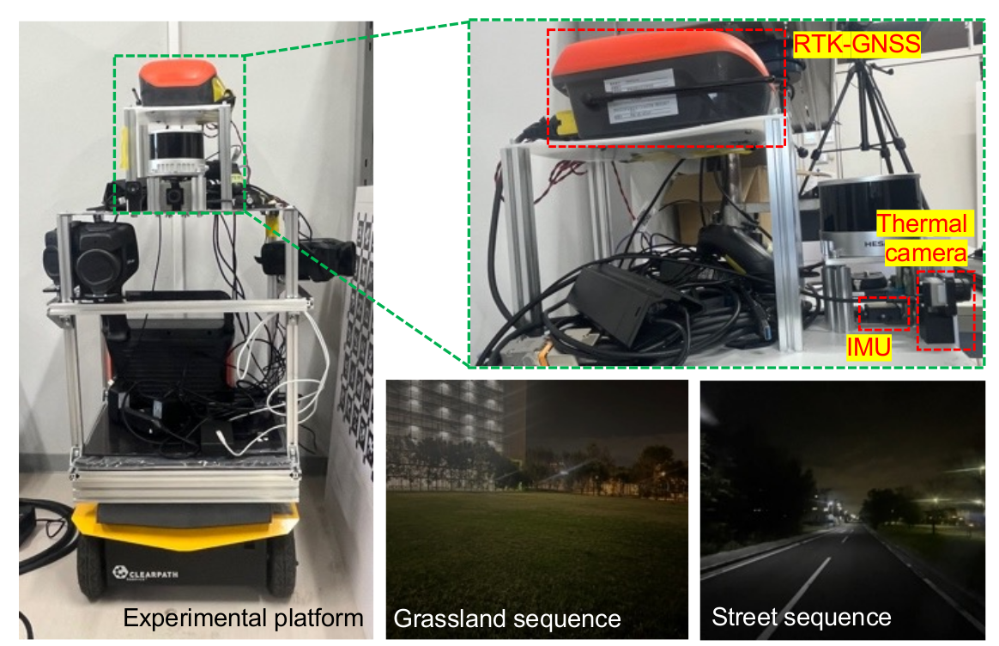

# Thermal-Inertial Dataset for Self-TIO
 
## Dataset
  * Download dataset
    - [[Google Drive](https://drive.google.com/drive/folders/1nSRaHt6HGazyHHi3sbUz7Nb7pw3BK9gm?usp=sharing)] (MicroStrain 3DM-GX5-25 IMU and FLIR Boson+640 Infrared Thermal Camera)
      

    

  

## Paper
  * Self-TIO: Thermal-Inertial Odometry via Self-Supervised 16-bit Feature Extractor and Tracker (Under review)
  * To appear after accepted
